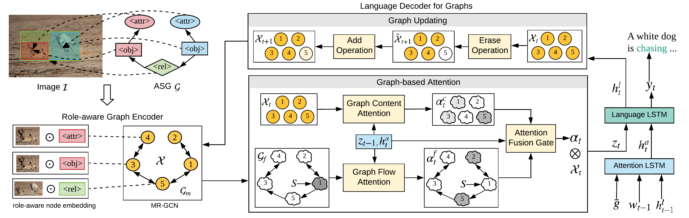
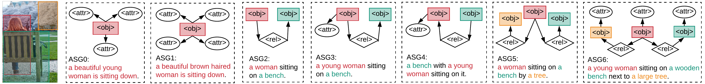

# Say As You Wish: Fine-grained Control of Image Caption Generation with Abstract Scene Graphs

This repository contains PyTorch implementation of our paper [Say As You Wish: Fine-grained Control of Image Caption Generation with Abstract Scene Graphs (CVPR 2020)](https://arxiv.org/abs/2003.00387).



## Prerequisites
Python 3 and PyTorch 1.3.

```
# clone the repository
git clone https://github.com/cshizhe/asg2cap.git
cd asg2cap
# clone caption evaluation codes
git clone https://github.com/cshizhe/eval_cap.git
export PYTHONPATH=$(pwd):${PYTHONPATH}
```

## Training & Inference
```
cd controlimcap/driver

# support caption models: [node, node.role, 
# rgcn, rgcn.flow, rgcn.memory, rgcn.flow.memory]
# see our paper for details
mtype=rgcn.flow.memory 

# setup config files
# you should modify data paths in configs/prepare_*_imgsg_config.py
python configs/prepare_coco_imgsg_config.py $mtype
resdir='' # copy the output string of the previous step

# training
python asg2caption.py $resdir/model.json $resdir/path.json $mtype --eval_loss --is_train --num_workers 8

# inference
python asg2caption.py $resdir/model.json $resdir/path.json $mtype --eval_set tst --num_workers 8
```

## Datasets

### Annotations
Annotations for MSCOCO and VisualGenome datasets can be download from [GoogleDrive](https://drive.google.com/open?id=1hzVhsxGQfA1ZILJ0RVkhcG57LepkjQEm).

- (Image, ASG, Caption) annotations: regionfiles/image_id.json

```
JSON Format:
{
	"region_id": {
		"objects":[
			{
	     		"object_id": int, 
	     		"name": str, 
	     		"attributes": [str],
				"x": int,
				"y": int, 
				"w": int, 
				"h": int
			}],
  	  "relationships": [
			{
				"relationship_id": int,
				"subject_id": int,
				"object_id": int,
				"name": str
			}],
  	  "phrase": str,
  }
}
```

- vocabularies
int2word.npy: [word]
word2int.json: {word: int}

- data splits: public_split directory
trn_names.npy, val_names.npy, tst_names.npy

### Features
We will make the extracted features for MSCOCO and VisualGenome datasets available soon.
We also provide pretrained models and codes to extract features on your own.

- Global Image Feature: the last mean pooling feature of [ResNet101 pretrained on ImageNet](https://pytorch.org/docs/stable/torchvision/models.html)

format: npy array, shape=(num_fts, dim_ft)
corresponding to the order in data_split names

- Region Image Feature: fc7 layer of [Faster-RCNN pretrained on VisualGenome](https://github.com/cshizhe/maskrcnn_benchmark)

format: hdf5 files, "image_id".jpg.hdf5

  key: 'image_id'.jpg
  
  attrs: {"image_w": int, "image_h": int, "boxes": 4d array (x1, y1, x2, y2)}
  
  
## Result Visualization
  

  
  
## Citations
If you use this code as part of any published research, we'd really appreciate it if you could cite the following paper:
```text
@article{chen2020say,
  title={Say As You Wish: Fine-grained Control of Image Caption Generation with Abstract Scene Graphs},
  author={Chen, Shizhe and Jin, Qin and Wang, Peng and Wu, Qi},
  journal={CVPR},
  year={2020}
}
```


## License

MIT License


